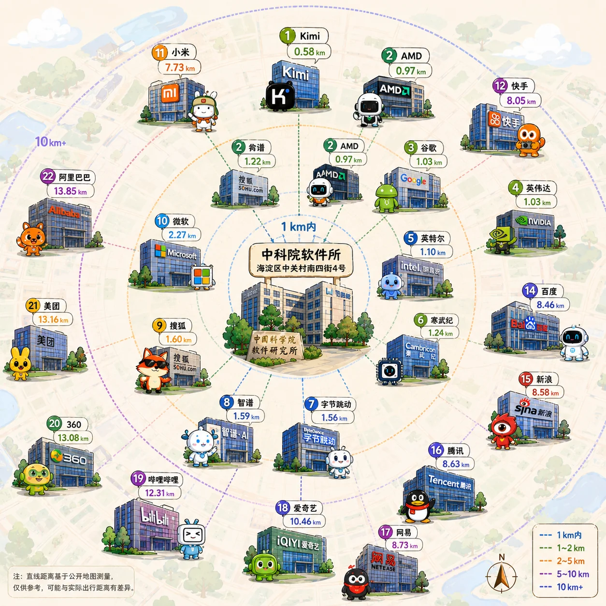
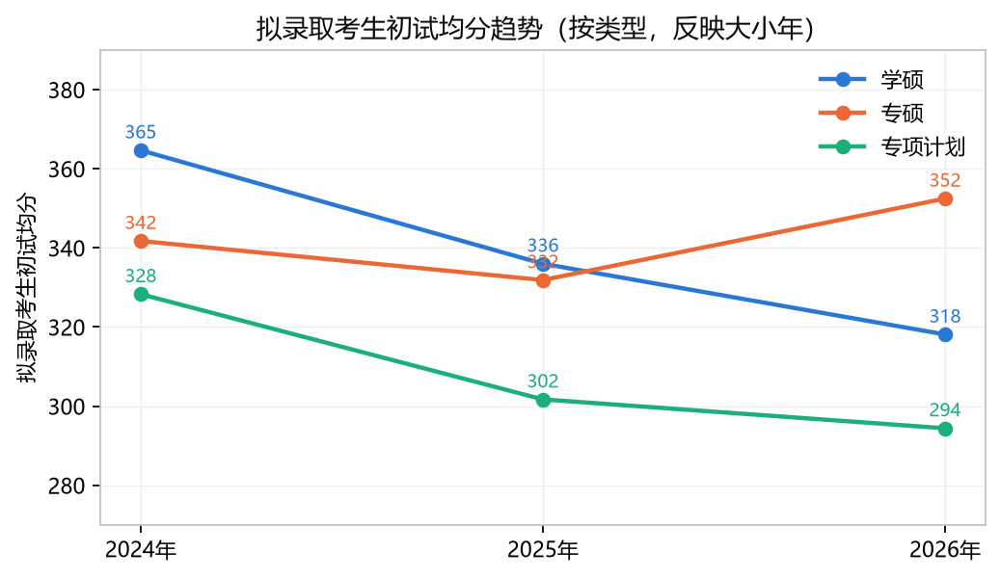
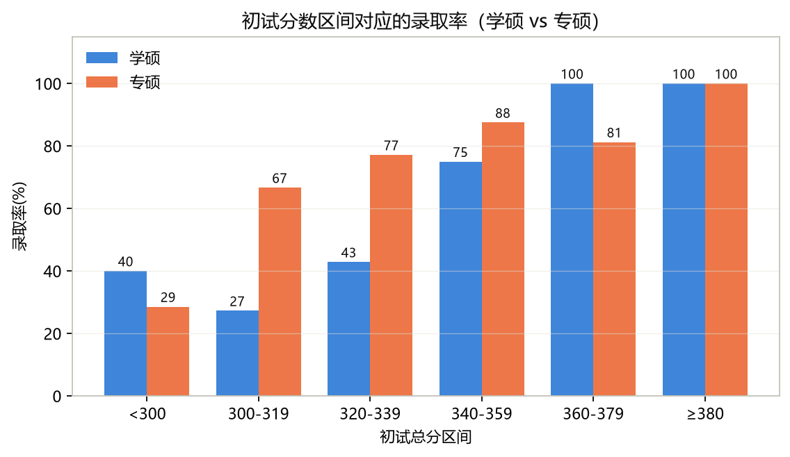
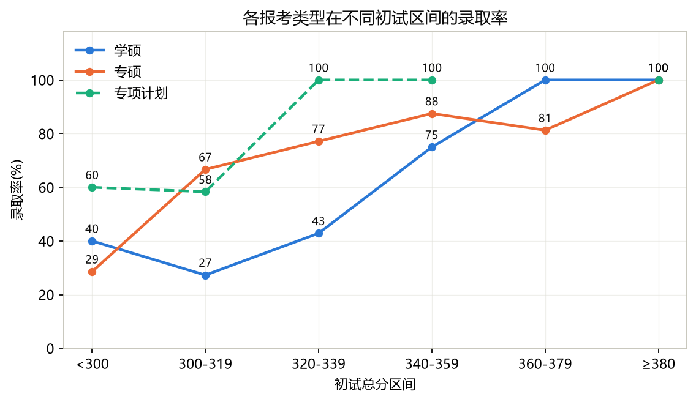
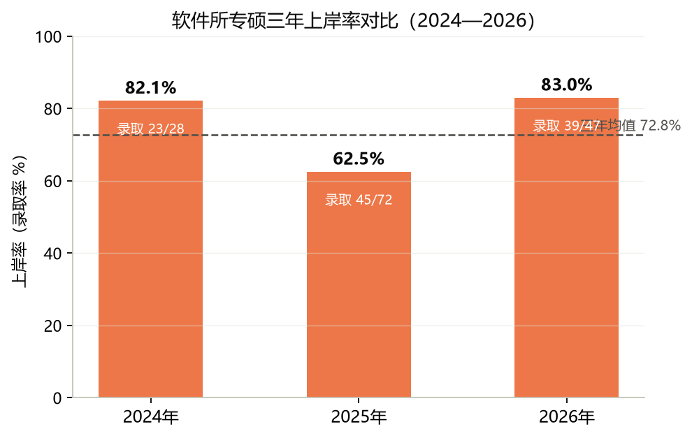

# 中国科学院软件研究所（ISCAS）考研报考指南

> 🎯 点击链接加入群聊【24-27软件所交流群】：[点此加群](https://qm.qq.com/q/NhrlBL5x2o)
>
> 兄弟院校推荐：
>
> 信工所  iie ：[点此加群](https://qun.qq.com/universal-share/share?ac=1&authKey=M4yxMWHgE9yzD2vk7nGtift%2BhaP2MYfYdv56wWOgMGTD4AfY6ABZdwPC%2FHSdqfRa&busi_data=eyJncm91cENvZGUiOiI4MjI4NDEzMzMiLCJ0b2tlbiI6IkNzSE5pMnl5alNmSmRJeVNKTWhTbkZrVHFqN1dTdTJVdnZUelBBVU9NM0xUMktaTjRFU1RWdUNUU1FJQ294OU4iLCJ1aW4iOiIyNTc3NTM5MjkwIn0%3D&data=y5wvomRqO2jq6LLWp0Sxid8pyT3UmVsWo1rIIckMP9rPga6WW6Csn4mJdLPHb3496bP8Ds0zyGL2h_Jq7JnxNw&svctype=4&tempid=h5_group_info)
>
> 计算所  ict：[点此加群](https://qun.qq.com/universal-share/share?ac=1&authKey=OzZAS3jeG1KhS/SchOveQuzrFB0THS3ykemropLyrii9Q0tDhWzuEfgBbATcQ14H&busi_data=eyJncm91cENvZGUiOiI3NDY1NzcyNzYiLCJ0b2tlbiI6IkpMSVJUaXhTSGJMOFM4bVluYy81NTdRa3FjZXRWdmFGWHd4eFJxelNqbTVaRnNEUkkvNGtmd0VWcjlnNG1JNHYiLCJ1aW4iOiIxODMyNjEwNjE5In0=&data=DdKFa5GnoEJznLT7tm251AcOibKm8xts-AhBy1DIdJ0DIermCL5yRGTvlBRikO8Ni-Q96X9LqWGTVMezsJtaIg&svctype=4&tempid=h5_group_info)
>
> 沈计所  sict：[点此加群](https://qm.qq.com/cgi-bin/qm/qr?k=r9u8RmL8tXw4jCF32Pz1tOd83sFteVW1&jump_from=webapi&authKey=Itu6in4pdGnalupvoOhfjHS5fzZsjCw0hgTiBdJh8oSiq1vSH3eiDwAenGR0UsCl)
>
> 人工智能学院华大专项  ：[点此加群](https://qm.qq.com/q/dZmGc3XFkI)

> ⚠️ **免责声明**：本指南为历届考生公益维护，非盈利，与中科院软件研究所无任何隶属或关联关系，非官方渠道。内容仅供参考，请以官方发布为准。详见 [免责声明](免责声明.md)。

现在是 2026 年七月，距离 27 考研初试还有不到 5 个月。相较于高校体系的高分需求，国科大体系无疑提供了更具性价比的选择。

> *"软件所到底好不好考？" "统考名额 7+X 是真的吗？" "听说国科大刷人很厉害，三无选手推荐考吗？"*

考研是一场信息战，选择往往比努力更重要。网上的经验贴鱼龙混杂，官方简章又总是惜字如金。为了帮之后报考的同学打破这层信息壁垒，我们整理了这篇 **《中科院软件所报考指南》**。

这里没有贩卖焦虑，也不盲目画饼。我们将从**真实报录数据、报考全流程、复试潜规则**等维度，为你揭开软件所的神秘面纱。无论你是志在基础软件的科研追梦人，还是看重中关村地段与就业的务实派，希望这篇指南，能成为你上岸路上的第一块垫脚石。

---

## 研究所概况

中国科学院软件研究所（ISCAS）成立于 1985 年 3 月 1 日，是一所致力于计算机科学理论和软件高新技术的研究与发展的综合性研究所。所址位于北京市海淀区中关村南四街 4 号中国科学院软件园区。

- **官网链接**：[中国科学院软件研究所](https://is.cas.cn/)
- **招生信息**：[招生信息——中国科学院软件研究所](https://is.cas.cn/yjsjy/zsxx/)

覆盖计算机、软件工程、AI 大模型、系统软件、数据库、分布式云计算、网络安全等领域。

### 位置优势

地处中关村核心区，互联网大厂与科技公司环绕，实习就业资源高度集中。以软件所（海淀区中关村南四街 4 号）为圆心，各科技公司北京总部/主办公区的直线距离前十如下：

| 排名 | 公司 | 北京办公地 | 直线距离 (km) |
|:--:|:-:|:-:|:-:|
| 1 | Kimi（月之暗面） | 京东科技大厦 | **0.58** |
| 2 | AMD | 融科资讯中心 C 座北楼 | **0.97** |
| 3 | 谷歌 | 融科资讯中心 B 座 | 1.03 |
| 4 | 英伟达 | 融科资讯中心 | 1.03 |
| 5 | 英特尔 | 英特尔中国研究院 | 1.10 |
| 6 | 寒武纪 | 致真大厦 D 座 | 1.24 |
| 7 | 字节跳动 | 字节大钟寺工区（seed） | 1.56 |
| 8 | 智谱 | 搜狐网络大厦 | 1.59 |
| 9 | 搜狐 | 搜狐网络大厦 | 1.60 |
| 10 | 微软 | 微软亚太研发集团大厦 | 2.27 |

> 📡 数据来源：高德地图 Web 服务 API（v5 地点搜索、地理编码），2026-08-14 实测；距离为两点间直线距离（Haversine 公式），仅供参考，非驾车/通勤距离。完整数据见 [北京科技公司距软件所直线距离](./复试准备/北京大厂距中科院软件研究所距离.md)。

### 招生实验室

目前考研招生的实验室有：

- 基础软件与系统重点实验室（计算机科学国家重点实验室）
- 并行软件与计算科学实验室
- 可信计算与信息保障实验室
- 基础软件国家工程研究中心
- 中文信息处理实验室
- 软件工程技术研究开发中心
- 人机交互技术与智能信息处理实验室
- 智能博弈重点实验室
- 智能软件研究中心
- 天基综合信息系统全国重点实验室

---

## 软所性价比对比

- **方向丰富**：涵盖可信计算、并行软件、中文信息处理、基础软件、人机交互、互联网软件技术、智能软件等多个方向，国科大计算机学科评估 A+
- **分数亲民**：2026 年学硕线 269、专硕线 300，学硕仅比国家线高 5 分——同级 985 计算机普遍 340–380+，同样的努力，在软所意味着能站上复试考场。
- **名额充足**：26 年专硕统考录取 39 人、学硕 9 人，名额透明可查，近两年专硕统考录取均在 39–45 人。
- **免学费 + 高补助**：研一补助 33000+/年（北京）、37200+/年（南京），已含学费返还，读研基本自给自足，详见[初试报考指南](./%E5%88%9D%E8%AF%95%E5%87%86%E5%A4%87/%E5%88%9D%E8%AF%95%E6%8A%A5%E8%80%83%E6%8C%87%E5%8D%97.md)。
- **平台与地段**：中科院体系、国家级重点实验室，导师项目经费充足；地处中关村，实习就业资源集中。
- **不歧视双非与二战**：更看重初试与复试表现，大量双非上岸案例见[经验分享](#经验分享)。
- **考 22408（专硕）也能转上学硕**：未招满的学硕名额会开放给专硕，初试高分 / 本科成绩优异的同学更容易拿到资格。
- **跨考建议**：小跨（如带电专业背景）可以，大跨不推荐；学硕不建议跨考。是否适合跨考，请结合自身基础自行判断。
- **保护一志愿**：不接受所外调剂。

> ⚠️ 理性看待：分数亲民意味着进复试的门槛低，但软所复试同样有筛选（26 年学硕 13 进复试录取 9、专硕 47 进录取 39）。初试分越高，主动权越大。

---

## 内容分享

[初试报考指南](./初试准备/初试报考指南.md)

> 报录数据、分数线、补助待遇一篇讲清

- 招生方向
- 初试科目
- 学费与待遇
- 培养情况
- 招生名额
- 分数线分析
- 报考建议

[复试考核指南](./复试准备/复试考核指南.md)

> 复试全流程与潜规则拆解：怎么联系导师、面试笔试考什么、学硕调剂怎么操作、南京学院代招怎么报

- 材料准备
- 联系老师
- 复试流程
  - 面试
  - 笔试
- 学硕调剂
- 食宿问题
- 实验室选择
- 南京学院代招

历年录取情况：[24年](./复试准备/24年录取情况.md) · [25年](./复试准备/25年录取情况.md) · [26年](./复试准备/26年录取情况.md)

- 复试组划分与专业方向
- 初试 / 复试 / 总成绩
- 拟录取 / 未录取标记

**近三年数据分析图**

---

## 经验分享

本仓库还收录了上岸同学的一手经验，欢迎按需查阅：

### 考研

- [民办三本一战上岸国科大软件所](./上岸经验分享/民办三本一战上岸国科大软件所.md) — 354 分专硕上岸，数学 129，竞赛经历丰富，详细的时间规划和各科备考策略
- [双非一本一战上岸国科大软件所](./上岸经验分享/双非一本一战上岸国科大软件所.md) — 省属重点本科，专硕上岸，软测国一，毕设聚焦开源软件供应链安全
- [北理工跨考国科大软件所学硕](./上岸经验分享/北理工跨考国科大软件所学硕.md) — 985 自动化跨考学硕，6 月启动，张宇数学体系 + 408 跨考复习策略
- [九本科班工作两年上岸国科大软件所](./上岸经验分享/九本科班工作两年上岸国科大软件所.md) — 工作两年后考研，英二 70+ 方法论，"跟基础课直接刷题"的数学思路，408 性价比做题策略
- [山师科班一战上岸国科大软件所](./上岸经验分享/山师科班一战上岸国科大软件所.md) — ICPC 银牌，6 月末启动，李范全书 + 自学的数学路线，袁春风的计组补充，408 各科针对性策略
- [双非一战上岸国科大软件所（短篇）](./上岸经验分享/双非一战上岸国科大软件所（短篇）.md) — 2.8 绩点，蓝桥杯+百度之星+开源操作系统训练营，毕设聚焦 seL4 形式化验证，复试做了依赖类型语言内核
- [厦大一战高分上岸国科大软件所](./上岸经验分享/厦大一战高分上岸国科大软件所.md) — 985 科班 400+ 高分上岸，机器人方向毕设，408 回归真题策略，LLM 辅助学习心得
- [江汉大学345顺子分数一战上岸国科大软件所](./上岸经验分享/江汉大学345顺子分数一战上岸国科大软件所.md) — 四非科班，智软南京学院专硕上岸，国奖+市长奖学金，复试一定要多准备
- [985一战400+上岸国科大软件所（Dave）](./上岸经验分享/985一战400+上岸国科大软件所（Dave）.md) — 985 科班 400+ 👑，保研边缘选手，每天 5h+ 的适中投入策略，武忠祥数学 + 王道 408 + 情绪管理心得，数二150
- [双非零基础一战上岸国科大软件所（TTao）](./上岸经验分享/双非零基础一战上岸国科大软件所（TTao）.md) — 江西双非零基础起步，四级四次才过，4 月启动，🐙三十讲+1000 题，390+，决定成绩的是执行力和坚持
- [四非一本一战上岸国科大软件所](./上岸经验分享/四非一本一战上岸国科大软件所.md) — 2.8 绩点，320+ 分专硕，两篇北核+专利+大创，复试靠科研翻盘
- [四非科班上岸国科大软件所](./上岸经验分享/四非科班上岸国科大软件所.md) — 四非科班，9 月全力开冲，英语 80+ 拉满，六级 620，推荐优质资料源和英语学习方法
- [九本三无摆子上岸国科大软件所](./上岸经验分享/九本三无摆子上岸国科大软件所.md) — 大工摆烂选手，360+ 调剂学硕，摆子如何上岸软所？
- [双非一本二战低分上岸国科大软件所](./上岸经验分享/双非一本二战低分上岸国科大软件所.md) — 二战低分上岸，初复试 5:5 先面试后笔试，复试只问项目、全程不歧视本科，附软所名额与专硕调剂学硕解读
- [双非二战上岸国科大软件所](./上岸经验分享/双非二战上岸国科大软件所.md) — 双非二战专硕上岸，"考得好不如报得巧"的择校观，数学直接开强化、错题隔周复盘，408 吃书+真题，复试 Zircon-like 微内核项目

### 保研

- [211 低 rk 保研上岸国科大软件所](./上岸经验分享/211低rk保研国科大软件所.md) — 211 本科 11/99 低 rk，夏令营优营上岸学硕，完整拆解夏令营六步流程，强调竞赛科研与实验室 match

> 📢 **经验分享持续征集中**，欢迎各位上岸同学[投稿](经验分享投稿模板.md)你的备考故事！

---

## 致谢

本指南的诞生离不开以下同学的热心分享与贡献（排名不分先后）：

  
  
  
  
  
  
  
  
  
  
  

  

  

  

  

  

  

<strong>佚名同学</strong>

> 🙏 _感谢每一位愿意花时间整理经验、回答问题的同学，你们的分享是后来者最宝贵的财富。_

同时也感谢所有在备考群、小红书、知乎等平台无私分享信息的同学们。一个人的经验是有限的，但一群人的智慧是无限的。

如果你想加入 [贡献者名单](CONTRIBUTORS.md)，欢迎通过下方方式分享你的经验！

---

## 如何贡献

这是一份由历届考生共同维护的开源指南，我们欢迎每一位上岸同学贡献自己的力量。

### 投稿方式

1. **提交 Issue**：在仓库 [Issues 页](https://github.com/ucas-cskaoyan-web/ISCAS-Application-Guide/issues)提出修改建议或补充内容
2. **提交 Pull Request**：Fork 本仓库，修改后提交 PR
3. **联系维护者**：如不熟悉 GitHub 操作，可联系当前维护者代为提交

### 投稿内容参考

- 个人备考经验（初试/复试均可）
- 实验室情况及导师评价
- 避坑经验与教训
- 任何你认为对后来者有价值的信息

> 投稿格式不限，真实即可。哪怕只是一段话、一个 tips，也可能对别人产生巨大帮助。

### 其他联系方式

- 🐧 **考研交流群**：欢迎加入软件所考研交流 QQ 群：**587081553**
- 📧 **联系邮箱**：1374146652@qq.com

---

## 许可

本指南采用 **CC BY-NC-SA 4.0** 许可协议，可自由分享与转载，但需注明出处，且不得用于商业用途。

---

*最后更新：2026 年 8 月 | 维护者：@ensemble @Hsin*
